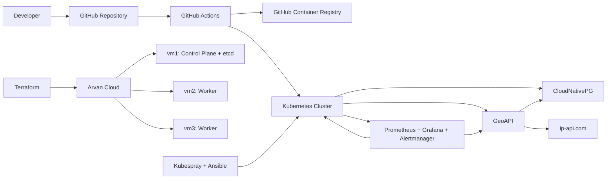

# Arvan Cloud SRE Challenge

This directory presents the completed challenge in a production-style, component-oriented format. It documents the full path from cloud provisioning to application delivery, database deployment, monitoring, dashboards, alerting, and continuous delivery.

The existing implementation, Kubernetes manifests, Terraform configuration, automation scripts, and CI workflow are preserved without functional changes. Only the documentation has been reorganized and expanded.

## Key Features

- **Infrastructure as Code**: Provisions three Arvan Cloud virtual machines and their private network with Terraform.
- **Automated Kubernetes Installation**: Builds a three-node Kubernetes cluster with Kubespray, Ansible, Calico, and containerd.
- **Image Preloading**: Supports restricted-registry scenarios by pushing container images to the nodes and importing them into containerd.
- **Highly Available Database**: Runs PostgreSQL through CloudNativePG with a primary and streaming replica.
- **Observable Application**: Deploys a Flask IP geolocation API with health checks, PostgreSQL caching, and Prometheus metrics.
- **Monitoring Platform**: Installs Prometheus, Grafana, and Alertmanager with a custom node overview dashboard.
- **Automated Delivery**: Tests, builds, publishes, and deploys the API through GitHub Actions and GHCR.

## Architecture



## Repository Structure

```text
prod-style-documented/
├── .github/workflows/       # GitHub Actions test, build, push, and deploy pipeline
├── api/                     # Flask application, tests, image definition, and Kubernetes resources
│   ├── k8s/                 # Namespace, secrets, Deployment, Service, and ServiceMonitor
│   └── metrics/             # Application metrics documentation
├── cicd/                    # Delivery pipeline documentation
├── database/                # CloudNativePG PostgreSQL cluster
├── infra/                   # Arvan Cloud Terraform configuration
│   └── push-load/           # Ansible automation for image transfer and containerd import
├── kubernetes/              # Kubespray inventory, installation, and kubeconfig helpers
└── observability/           # Prometheus stack values, dashboards, and access helpers
```

## Documentation Map

- [Application](api/README.md)
- [Infrastructure](infra/README.md)
- [Kubernetes](kubernetes/README.md)
- [Database](database/README.md)
- [Observability](observability/README.md)
- [CI/CD](cicd/README.md)

## Deployment Sequence

The components are designed to be applied in the following order. Each linked README contains the component-specific prerequisites, files, commands, and verification steps.

### Step 1: Provision Arvan Cloud Infrastructure

Use the Terraform configuration in [`infra/`](infra/README.md) to provision the private network and the three virtual machines named `vm1`, `vm2`, and `vm3`.

### Step 2: Prepare Cluster Images When Required

If direct image pulls are restricted, use [`infra/push-load/`](infra/README.md#optional-preload-kubespray-images) to download images on the controller, transfer them to each node, and import them into the `k8s.io` containerd namespace.

### Step 3: Install Kubernetes

Generate the Kubespray inventory from Terraform outputs, install the cluster, and fetch the administrator kubeconfig using the scripts in [`kubernetes/`](kubernetes/README.md).

The resulting topology is:

| Node | Kubernetes Role |
|---|---|
| `vm1` | Control plane and etcd |
| `vm2` | Worker |
| `vm3` | Worker |

### Step 4: Deploy PostgreSQL

Install the CloudNativePG operator and apply [`database/cluster.yaml`](database/cluster.yaml). The cluster runs two PostgreSQL instances with pod anti-affinity so the primary and replica can run on separate workers.

### Step 5: Install Observability

Install `kube-prometheus-stack` with [`observability/values.yaml`](observability/values.yaml). The configured stack includes Prometheus, Grafana, Alertmanager, and node exporter.

### Step 6: Deploy the GeoAPI

Apply the resources in [`api/k8s/`](api/k8s/) to create the application namespace, database connection secret, registry pull secret, Deployment, Service, and ServiceMonitor.

### Step 7: Enable Continuous Delivery

Configure the required repository secrets and use [`.github/workflows/geoapi.yml`](.github/workflows/geoapi.yml) to run unit tests, publish immutable and `latest` images to GHCR, apply the Kubernetes resources, and update the running image to the commit SHA.

## Application Interface

| Endpoint | Purpose |
|---|---|
| `GET /iploc?ip=8.8.8.8` | Returns the IP country from PostgreSQL cache or the external lookup service |
| `GET /health` | Kubernetes liveness and readiness endpoint |
| `GET /metrics` | Prometheus metrics endpoint |

## Operational Evidence

- Kubernetes node snapshot: [`kubernetes/output/nodes`](kubernetes/output/nodes)
- Kubernetes workload snapshot: [`kubernetes/output/pods`](kubernetes/output/pods)
- Grafana dashboard definition: [`observability/dashboards/nodes-overview.json`](observability/dashboards/nodes-overview.json)
- Grafana screenshots: [`observability/dashboards/screenshots/`](observability/dashboards/screenshots/)
- API verification notes: [`api/test-api.md`](api/test-api.md)
